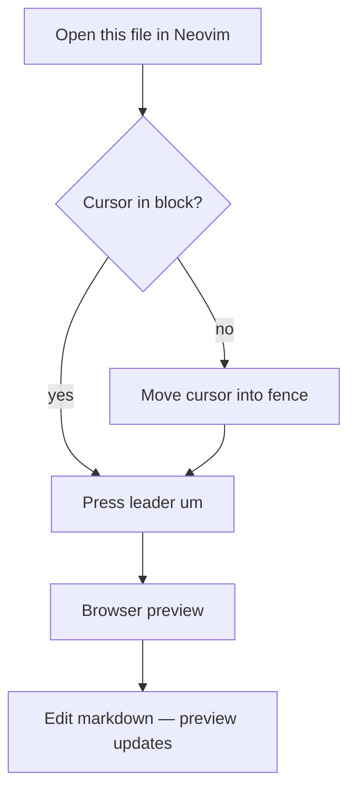
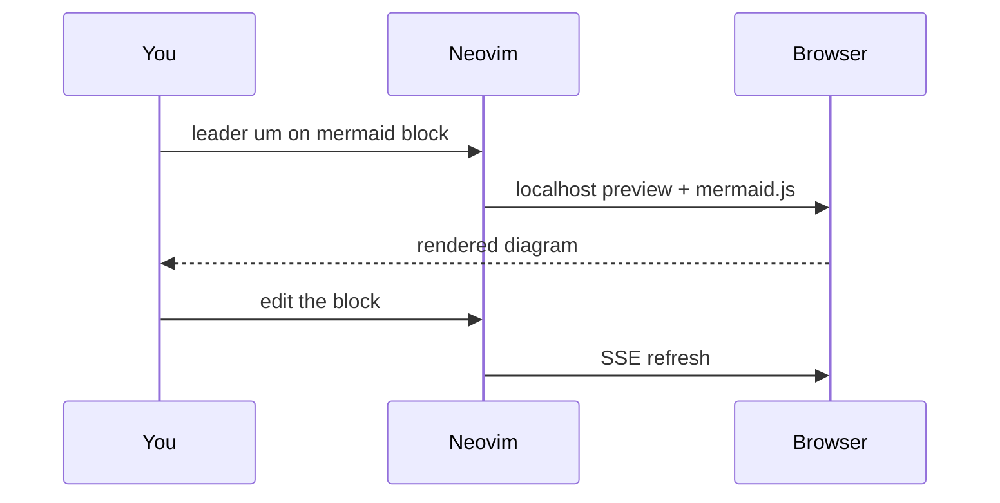
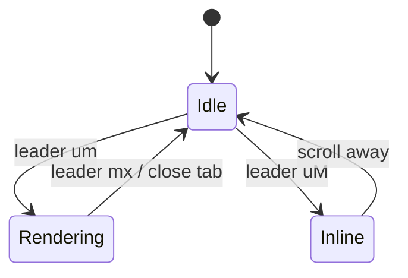

# Mermaid test file

Put the cursor inside a fenced block below, then:

- `<leader>um` — live browser preview
- `<leader>uM` — inline terminal render (needs `mmdc` + chafa or Kitty)

## Flowchart

## Sequence

## State

